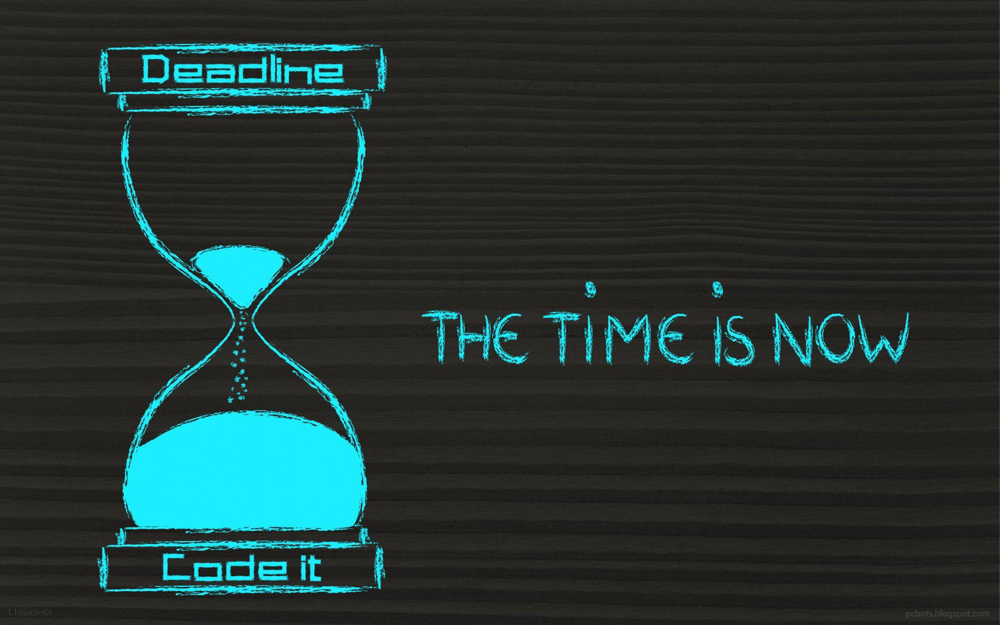

   
  <h1 align="center">👋 This is Amir Khodadi ! A Junior backend Programmer </h1>
  <h2> My Expertise : </h2>
   
  

  ## About Me

🌟 I am passionate about **backend web development** and specialize in creating robust, scalable, and efficient server-side applications. For me, backend development is the backbone of any successful digital experience, ensuring reliability and performance.

🚀 Currently, I’m focused on honing my skills in **Python** and **Django**, crafting APIs, managing databases, and implementing secure, high-performing backend systems.

🎯 I’m eager to collaborate on projects that involve building powerful backend architectures, designing RESTful APIs, and solving challenging server-side problems. If you’re interested in creating cutting-edge web applications, let’s connect and discuss how we can collaborate.

---

### Skills & Technologies

- **Programming Languages:** Python, JavaScript
- **Backend Frameworks:** Django, Django REST Framework
- **Databases:** PostgreSQL, MySQL, SQLite
- **APIs:** RESTful API Development
- **Tools & Platforms:** Docker, Celery, Redis, Git
- **Other Skills:** Authentication & Authorization (OAuth2, JWT), Deployment (Heroku, AWS, Linux Servers)

---

### Current Goals

- Enhance expertise in **Django** and its ecosystem.
- Dive deeper into **asynchronous programming** and **real-time communication** using Django Channels.
- Collaborate on projects requiring **scalable and secure backend systems**.

---

### Let’s Connect

📧 Feel free to reach out to me via email at **amiramkhodadi@gmail.com**. I’m always open to exploring new projects and opportunities to collaborate on exciting backend challenges.

---

### Socials

  
  <a href="https://t.me/amiram_khodadi" rel="nofollow">
    
   

  

 
  

